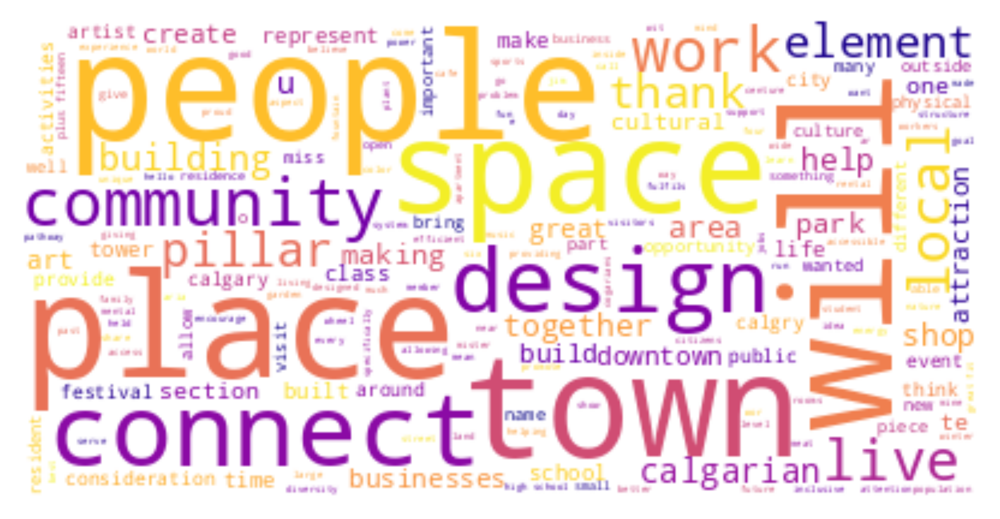

# Level Up, Calgary!

> The City’s Downtown Strategy team collaborated with the Calgary Board of Education (CBE), the Calgary Public Library, and Microsoft Canada to launch Level Up, Calgary! This is the first student Minecraft: Education Edition design challenge of its kind in Canada. CBE Students from all grade levels accessed a custom world, including the heart of Calgary’s downtown core rendered in Minecraft. Students were asked to submit a design in response to the following design prompt: How might we reimagine our public spaces to enrich the lives of Calgarians and strengthen our community?

## What are they talking about?

